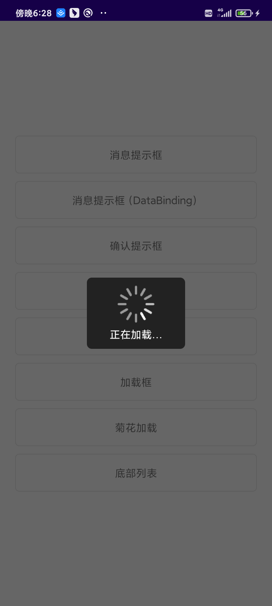

# VipDialog
一个极其简单的Dialog弹出框，方便拓展，简洁使用！
## 快速开始

1、在你的根项目下的build.gradle文件下，引入maven。

```groovy
allprojects {
    repositories {
        maven { url "https://gitee.com/AbnerAndroid/almighty/raw/master" }
    }
}
```
2、在你需要使用的Module中build.gradle文件下，引入依赖。
```groovy
dependencies {
    implementation 'com.vip:dialog:1.0.0'
}
```
## 基本用法

1、普通调用。
```kotlin
 showVipDialog {
                    addLayout(R.layout.layout_dialog_custom)//添加弹出的视图
                    set {//逻辑处理，获取view,绑定数据
                        setDialogCancelable(false)//点击空白不消失
                        val btnConfirm = findView<TextView>(R.id.dialog_button_confirm)
                        btnConfirm.setOnClickListener {
                            toast("确定")
                            dismiss()
                        }
                    }
                }
```
2、DataBinding形式调用。
```kotlin
 showVipDialog {
                    addLayout(R.layout.layout_dialog_custom)//添加弹出的视图
                    bind<LayoutDialogCustomBinding> {//逻辑处理，获取view,绑定数据
                        it.dialogButtonConfirm.setOnClickListener {
                            toast("确定")
                            dismiss()
                        }
                    }
                }
```

## 学习文档

[简单封装一个易拓展的Dialog](https://mp.weixin.qq.com/s/7f1vugyLsJKc6DiwtXVZ-A)

## Demo效果预览





## 欢迎关注作者

微信搜索【Android干货铺】，或扫描下面二维码关注，查阅更多技术文章！


## License

```
Copyright (C) AbnerMing, VipDialog Open Source Project

Licensed under the Apache License, Version 2.0 (the "License");
you may not use this file except in compliance with the License.
You may obtain a copy of the License at

     http://www.apache.org/licenses/LICENSE-2.0

Unless required by applicable law or agreed to in writing, software
distributed under the License is distributed on an "AS IS" BASIS,
WITHOUT WARRANTIES OR CONDITIONS OF ANY KIND, either express or implied.
See the License for the specific language governing permissions and
limitations under the License.
```
